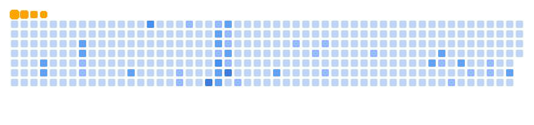

# Olá! 👋 Eu sou BellkaDEV

💻 **Desenvolvedor / Entusiasta de Tecnologia**  
🚀 Apaixonado por criar projetos incríveis e aprender coisas novas todos os dias.

---

## 🔧 Tecnologias que uso

---

## 🌱 Estou aprendendo

- Estruturas de dados avançadas  
- Algoritmos  
- Inteligência Artificial  

---

## 📂 Meus Projetos

| Projeto | Descrição | Link |
|---------|-----------|------|
|  |  |  |
|  |  |  |
|  |  |  |

---

## 🎬 GitHub Snake

  
  

> O gráfico animado mostra minhas contribuições e streaks no GitHub!  

---

## 📫 Contato

- Email: bellka@email.com  
- LinkedIn: [BellkaDEV](https://www.linkedin.com/in/bellkadev/)  
- Twitter: [@BellkaDEV](https://twitter.com/BellkaDEV)  

---

## 📊 Estatísticas do GitHub

