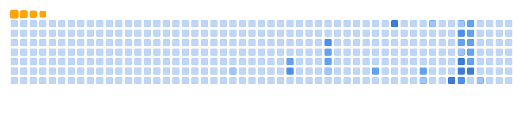

# Olá! 👋 Eu sou BellkaDEV

💻 **Desenvolvedora / Entusiasta de Tecnologia**  
🚀 Apaixonada por criar projetos incríveis e aprender coisas novas todos os dias.

---

## 🔧 Tecnologias que uso

---

## 🌱 Estou aprendendo

- Inteligência Artificial  
- Desenvolvimento Mobile  
- Cloud Computing  

---

## 📂 Meus Projetos

| Projeto | Descrição | Link |
|---------|-----------|------|
| Meu Portfolio | Meu site pessoal mostrando meus projetos | [Ver](https://github.com/BellkaDEV/portfolio) |
| Chatbot IA | Chatbot feito com Python e NLP | [Ver](https://github.com/BellkaDEV/chatbot-ia) |
| Jogo Web | Jogo divertido em JavaScript | [Ver](https://github.com/BellkaDEV/jogo-web) |

---

## 🎬 GitHub Snake

  
  

> O gráfico animado mostra minhas contribuições e streaks no GitHub!  

---

## 📫 Contato

- Email: bellka@email.com  
- LinkedIn: [BellkaDEV](https://www.linkedin.com/in/bellkadev/)  
- Twitter: [@BellkaDEV](https://twitter.com/BellkaDEV)  

---

## 📊 Estatísticas do GitHub

